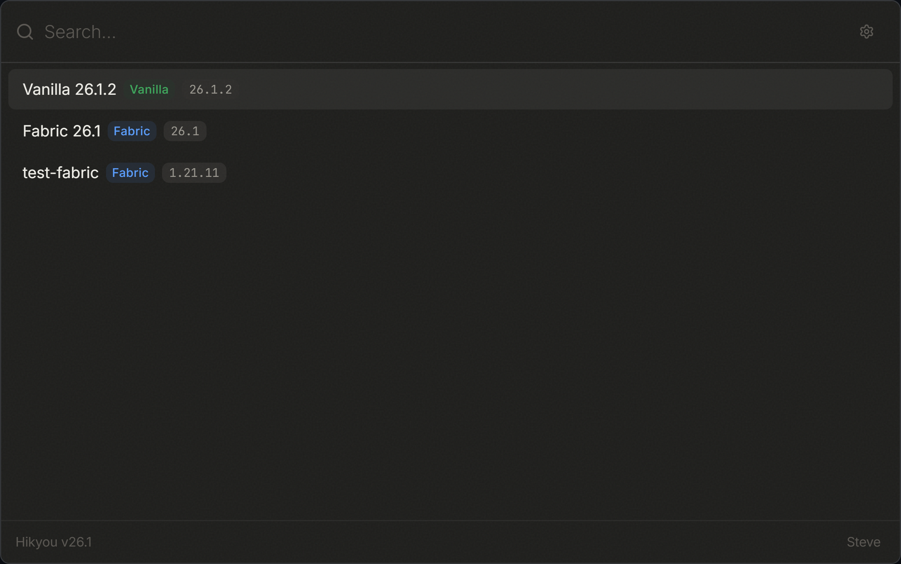

<div align="center">

# Hikyou Launcher

**A command-native Minecraft launcher for players who want the fastest path from idea to game.**

[](LICENSE)
[](https://tauri.app)
[](https://www.rust-lang.org)
[](https://react.dev)
[](#platform-support)

<br />



</div>

---

## Why This Exists

Minecraft launchers are often either too heavy, too generic, or too far away from how technical players actually work.

Hikyou Launcher treats launching Minecraft as a direct command surface: press a shortcut, type what you want, launch the right profile, manage mods, inspect logs, and get back to playing. The launcher is built around Minecraft-native concepts from the first pixel: profiles, loaders, modpacks, crash diagnostics, Java runtimes, accounts, and server-specific workflows.

The long-term goal is a launcher that removes routine setup work without hiding power from advanced users: a small native shell, a Rust core, a focused React UI, and enough structure to grow into a serious community project.

## What Works Today

- **Keyboard-first profile launcher** with a compact native command window
- **Independent profiles** with separate game directories, mod sets, memory, and window settings
- **Minecraft version support** through Mojang manifests
- **Loader support** for Vanilla, Fabric, Quilt, Forge, and NeoForge
- **Modrinth integration** for searching and installing mods
- **Modpack install flow** from Modrinth `.mrpack` projects
- **Smart profiles** with Latest+ and Snapshot+ as stable launcher-managed profiles
- **Recommended auto mods** with dependency-aware planning, optional-mod skipping, conflict repair, and freshness caching
- **Microsoft account login** using the Xbox/Minecraft authentication chain
- **Java management** with automatic runtime selection and download
- **JVM tuning modes** including Smooth defaults and an opt-in Performance Lab
- **Game log streaming**, a dedicated Log Inspector, structured crash diagnostics, and launch metrics
- **SQLite-backed local storage** for disposable API cache data and launcher-owned state history
- **Secure credential storage** selected per platform

## Loader Support

| Loader   | Current target       |
| -------- | -------------------- |
| Vanilla  | All release versions |
| Fabric   | 1.14+                |
| Quilt    | 1.14+                |
| Forge    | up to 1.20.1         |
| NeoForge | 1.20.2+              |

## Platform Support

| Platform | Priority    | Notes                                        |
| -------- | ----------- | -------------------------------------------- |
| Windows  | Primary     | Main development target                      |
| macOS    | Secondary   | Supported, with native window polish         |
| Linux    | Best effort | Supported, but not the current polish target |

## Security Model

Hikyou stores account tokens outside `settings.json`. The frontend keeps account metadata, while token material is stored through the Rust backend.

| Platform | Storage backend                                                        |
| -------- | ---------------------------------------------------------------------- |
| Windows  | TPM-backed NCrypt flow, with DPAPI fallback                            |
| macOS    | Secure Enclave when available, with machine-bound AES-256-GCM fallback |
| Linux    | machine-id-bound AES-256-GCM plus permission-600 files                 |

Linux support is currently lower priority than Windows and macOS, but token storage is no longer plain text.

## Architecture

```text
src/                         React + TypeScript UI
src/components/              Launcher panels and reusable UI pieces
src/hooks/                   UI state, keyboard flow, Tauri integration
src/hooks/navigation/        Command-window keyboard behavior
src-tauri/src/commands/      Tauri command surface
src-tauri/src/core/          Minecraft manifests, loaders, Java, mods, launch logic
src-tauri/src/core/mod_*     Mod providers, installer, recommendations, modpacks, sync state
src-tauri/src/core/crash_*   Crash parsing, rule DB, matching, messages, diagnostics
src-tauri/src/auth/          Microsoft/Xbox/Minecraft auth and secure storage
```

Core choices:

- **Tauri 2** instead of Electron, keeping the launcher small and native
- **Rust** for launch orchestration, downloads, auth storage, caching, and filesystem work
- **React + TypeScript** for fast UI iteration
- **Bun** for frontend dependency management and builds
- **SQLite** for local API response caching and launcher-owned state history

The codebase is intentionally split by ownership boundaries rather than by technology alone. Modrinth provider logic, install commit logic, launch orchestration, crash rule data, and UI primitives are separated so contributors can change one behavior without learning the entire app.

Local state is deliberately separated by purpose:

- `caches/cache.db` is disposable provider/API cache data.
- `state/launcher_state.db` is launcher-owned history such as launch metrics and future profile health signals.
- Profile directories own game files and `.minecraft/mods` state.

## Build From Source

Requirements:

- Windows 10 1803+ x64, macOS 10.15+, or modern Linux x64
- Rust stable
- Bun
- Platform-specific Tauri prerequisites

The repository contains no signing keys, account credentials, or local
environment files. Keep signing credentials in your local environment only;
they are intentionally excluded by `.gitignore`.

```bash
git clone https://github.com/Hikyou-SMP/hikyou-launcher.git
cd hikyou-launcher
bun install
bun run tauri build
```

For development:

```bash
bun install
bun run tauri dev
```

## Project Status

Hikyou Launcher is in active development and should currently be treated as a
**pre-release Beta**. The core launcher path is real, but compatibility testing,
especially across older loaders and platforms, is still expanding. Back up
important profiles before trying a pre-release build.

For security reports, see [SECURITY.md](SECURITY.md). Do not post sensitive
security details in a public issue.

Good areas to contribute:

- Minecraft launch compatibility across old and new versions
- Fabric / Quilt / Forge / NeoForge edge cases
- Modrinth mod and modpack install UX
- Smart profile behavior, especially Latest+ / Snapshot+ update policy
- Crash log parsing and human-readable diagnostics
- Launch metrics and performance diagnostics
- Java runtime detection and runtime selection
- Windows and macOS polish
- Accessibility, keyboard navigation, and localization
- Small refactors that keep workflow boundaries clean
- Tests around loader metadata, path safety, mod installs, and launch arguments

See [CONTRIBUTING.md](CONTRIBUTING.md) for setup notes, useful checks, and issue guidelines.

## Roadmap Ideas

- A fuller whole-plan auto mod solver that reasons over candidate sets before commit
- Better smart profile status surfaces for fresh / updating / repaired / optional skipped states
- Wider cross-version launch regression coverage for Vanilla, Fabric, Forge, NeoForge, and smart profiles
- Server-specific profiles and account selection
- Shared folders and reusable mod groups
- More specific crash explanations with mod names, required dependencies, confidence, and evidence lines
- Deterministic crash diagnosis rules that contributors can improve with real logs and schema-backed fixtures
- Sandboxed extension or script surface for advanced workflows

Deferred work:

- CurseForge integration is intentionally not part of the current product line.
- Local AI crash summarization is not the current direction; deterministic diagnostics are preferred for correctness, privacy, and debuggability.

## Support The Project

If this is the kind of launcher you have wanted, the most useful support right now is:

- Star the repository so more Minecraft developers notice it
- Try builds and report exact platform/version issues
- Share screenshots, UX feedback, and launcher workflows you want supported
- Open focused issues for loader, modpack, auth, or Java problems
- Send small PRs with tests, docs, translations, or compatibility fixes

## License

[GPL-3.0](LICENSE)

---

<div align="center">
Built with Rust, Tauri, React, and a bias toward zero-friction Minecraft launch.
</div>
